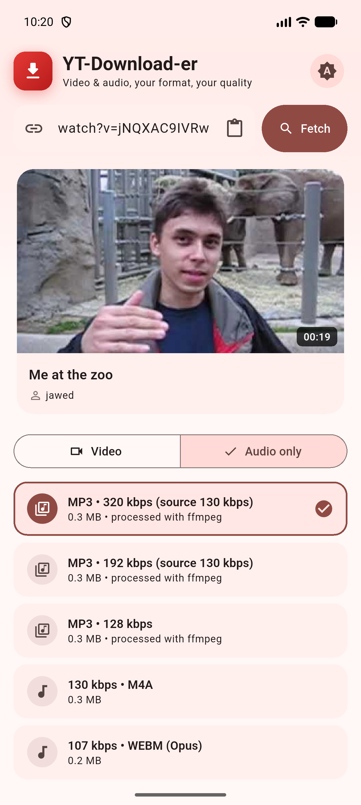
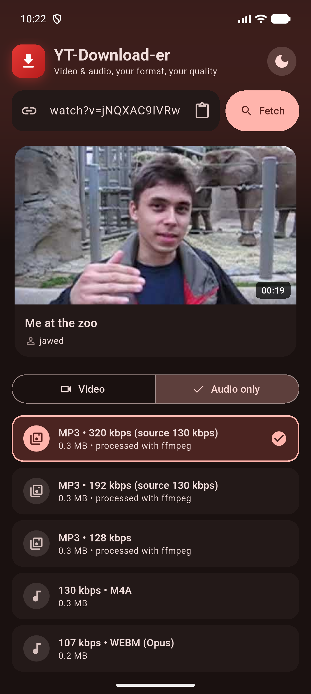

# YT-Downloader

[](https://github.com/dhivadhiva/YT-Downloader/actions/workflows/build.yml)
[](LICENSE)
[](https://flutter.dev)

Cross-platform Flutter app by **DhivaLabs** to download YouTube videos as
**video or audio**, in the format and quality you choose.

<p align="center">
  
  &nbsp;&nbsp;
  
</p>

## Features

- 🔗 Paste a YouTube link → fetch title, thumbnail, channel, and duration
- 🎬 **Video mode** — pick from all available qualities (MP4 / WebM),
  including 1080p+ (video-only stream merged with best audio)
- 🎵 **Audio mode** — MP3 (320/192/128 kbps), M4A, or WebM-Opus
- 🔁 Works both directions:
  - any *video* link can be saved as **audio only**
  - any *audio* can be saved as a **video** ("Blank screen + audio" MP4)
- ⬇️ **Parallel downloads** — queue several at once, each with its own
  progress bar; cancel any mid-flight
- 🎨 Light / dark / system theme toggle (persisted)
- ✅ Completion popup with a jump to the saved file
- 📁 Saves to your Downloads folder — sanitized names, no overwrites

ffmpeg-powered features (MP3, 1080p+ merges, blank-screen video) work
out of the box on Android/iOS via bundled
[`ffmpeg_kit_flutter_new`](https://pub.dev/packages/ffmpeg_kit_flutter_new);
on Linux they use the system `ffmpeg`.

## Platforms

| Platform | Status | Notes |
| --- | --- | --- |
| Android | ✅ | Saves to public `Download` folder |
| Linux | ✅ | ffmpeg extras when installed |
| Windows | ✅ | Built via CI (`flutter build windows` locally on Windows) |
| macOS | 🟡 untested | Should work — standard Flutter desktop target |

## Install

Grab the latest APK / Linux tarball / Windows zip from
[Releases](https://github.com/dhivadhiva/YT-Downloader/releases), or build
from source:

```bash
git clone https://github.com/dhivadhiva/YT-Downloader.git
cd YT-Downloader
flutter pub get
flutter run                 # develop
flutter build apk           # Android
flutter build linux         # Linux
flutter build windows       # Windows (on a Windows machine)
```

Optional but recommended on desktop:

```bash
sudo apt install ffmpeg     # enables 1080p+ merge, MP3, blank-screen video
```

## How it works

Built on [`youtube_explode_dart`](https://pub.dev/packages/youtube_explode_dart)
— it reads YouTube's stream manifests directly, no API key needed.
[lib/yt_service.dart](lib/yt_service.dart) handles stream selection,
downloading, and the ffmpeg merge/convert/render steps;
[lib/home_page.dart](lib/home_page.dart) is the single-screen UI.

Quality options above 720p ship as separate video and audio streams on
YouTube's side, so those (and MP3 / blank-screen renders) require ffmpeg and
are shown only when it's detected on the system.

## Smoke test

Exercises the fetch/download pipeline against a real video from the CLI:

```bash
dart run tool/live_check.dart
```

## CI

GitHub Actions builds Android, Linux, and Windows on every push. Tagging
`v*` publishes a release with all three artifacts:

```bash
git tag v1.0.0 && git push --tags
```

## Disclaimer

Downloading YouTube content may violate YouTube's Terms of Service and can
infringe copyright. Use only for personal, offline viewing of content you have
the right to download.

## License

[MIT](LICENSE)
